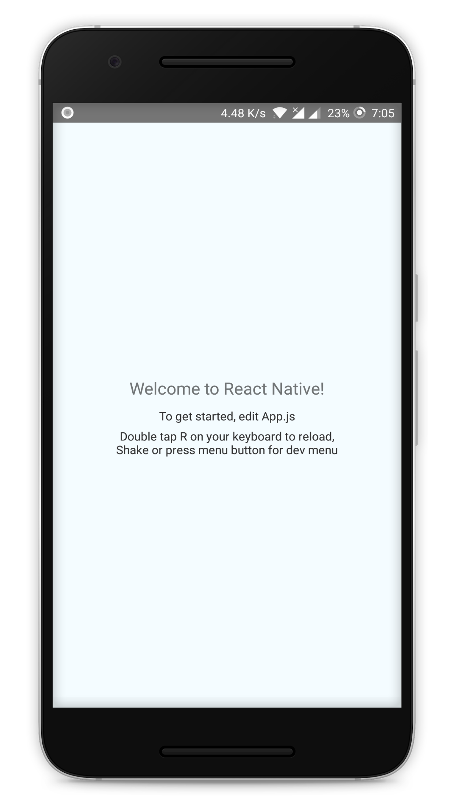
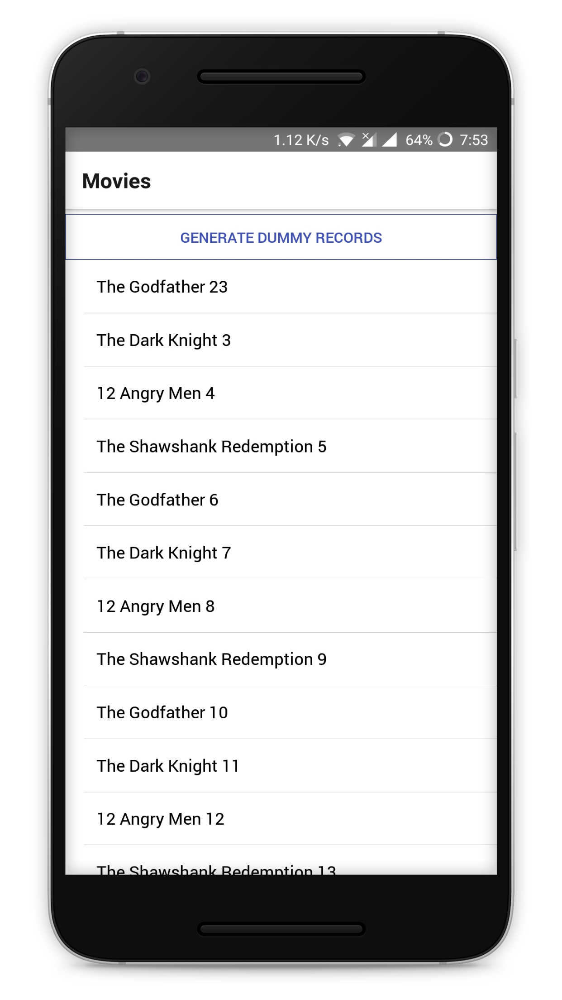

# MovieDirectory

A React Native Application showcasing the use of [WatermelonDB](https://github.com/Nozbe/WatermelonDB) to create offline first applications.

## Run the application

Clone the repo,

```powershell
git clone https://github.com/drex44/MovieDirectory.git
```

Install dependencies,

```powershell
cd MovieDirectory
npm i
```

Run the application,

```powershell
npm run start:android
```

## Tutorial

Full tutorial is available on SPBooks.

## Code structure

### Master branch


### v0.2 branch



### v0.0 branch


